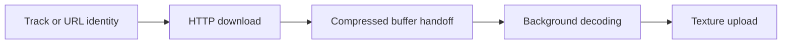

# Artwork pipeline

<!-- BEGIN TOC -->

## Contents

- [Artwork identity](#artwork-identity)
- [Transport and failure handling](#transport-and-failure-handling)
- [Buffer handoff](#buffer-handoff)
- [Background decoding](#background-decoding)
  - [Scheduling](#scheduling)
- [Texture upload](#texture-upload)

<!-- END TOC -->

CD recognition and AriaCast share image downloading and the UI decoding and
texture path. Compressed images travel separately from audio snapshots, with
metadata attached so each stage can reject obsolete work.

## Artwork identity

**Do not cache Aria artwork by URL alone.** Aria can replace an image while
keeping the same URL. Changes to title, artist, album or URL invalidate its cover
through downloading, decoding and display.

CD recognition uses the artwork URL as its identity. Moving to another track on
the same album retains the cover; ejecting the disc clears it. Downloads,
decoder completions and displayed images use the same source-specific identity
rule. An identity change hides the previous cover immediately.

## Transport and failure handling

The [receiver](receiver.h) downloads from plain HTTP URLs with numeric IPv4 hosts. TLS, DNS,
redirects and compressed HTTP responses are unsupported. It accepts JPEG/PNG
image data for the UI decoder. See the
[artwork contract](../../../../shared/contracts/artwork.json) for the shared size
limit.

Artwork identity changes cancel obsolete downloads. Temporary failures are retried;
unsupported URLs and oversized images require an identity change. Artwork
failure does not disconnect audio. See [shared display rules](../../ui/README.md#metadata-and-artwork) for more details.

Nonblocking sockets still use synchronous PS2 RPC calls. Timeout checks run
between calls and cannot interrupt a blocked RPC. Network artwork work therefore
needs to remain bounded and give audio service priority. Aria performs one read
per service step. CD allows a small burst of queued reads, stopping early on a
short read or elapsed time budget, then retains its normal worker sleep. Metadata
retry frequency is unchanged. The burst budget limits additional work; it cannot
guarantee a maximum RPC duration.

Completed downloads become an [ArtworkBlob](artwork.h): compressed bytes, their
size and the metadata snapshot identifying the image. Taking a completed blob
transfers its heap-buffer ownership out of the receiver.

## Buffer handoff

Before drawing each frame, the [application adapter](../../../stroom/app/artwork.h)
takes a matching cover from network playback or the CD recognition client and
passes it to the UI with the current source's identity rule. Preparation
continues in fullscreen; detecting, waiting and listening clear the cover.

The UI checks the downloaded blob against the current metadata before submitting
it to the decoder. A successful submission transfers buffer ownership to the
worker and clears the caller's blob. The adapter frees any buffer the decoder
does not accept. Replacing a pending decode job frees the previous pending
buffer; a decode already in progress can finish, but its result must still pass
the identity check before use.

## Background decoding

The [decoder worker](../../ui/artwork/worker.h) runs below the renderer's priority.
It takes a pending compressed image under the mailbox lock, then decodes outside
the lock. JPEG and PNG decoding enforce the shared size and dimension limits and
fit the original aspect ratio into a fixed-size CT32 image. The worker frees the
compressed buffer after decoding, including on failure.

The worker publishes the decoded pixels, metadata and success flag through its
mailbox. It holds those pixels unchanged until the renderer collects the result.
Collection copies a matching result without waiting for decoding; stale results
are consumed without changing the current image. A failed decode is consumed
but its pixels must not be displayed.

### Scheduling

The decoder can use CPU time while the renderer waits for the presentation
refresh. After graphics submission completes and before presentation, the
renderer also yields an explicit artwork time slice when decoding work is
runnable. This allows decoding to progress after expensive frames, but the yield
can extend the frame. An idle decoder does not cause that yield. Neither this
scheduling nor the bounded download work guarantees freedom from audio underruns.

## Texture upload

The [artwork view](../../ui/artwork/view.h) accepts valid completions matching the
current identity on the renderer thread. A new image marks the texture for
upload. When the cover is drawn, the renderer allocates cover VRAM if needed and
uploads the pixels; subsequent draws reuse the cached texture. Allocation and
upload stay on the renderer thread, while decoding and compressed-buffer release
stay on the worker. Identity changes invalidate the old image and upload state
without requiring a new VRAM allocation for every cover.

Decoder shutdown must succeed before the graphics context is destroyed. Active
decoding leaves cleanup pending until the worker exits and releases its owned
buffers. Failed cleanup retains ownership for a later close attempt. Destroying
the graphics context resets the view's texture allocation.

In diagnostic builds, the application adapter connects decoding and texture
upload observations to the network diagnostic sink. See
[artwork timings](../../../../tools/diagnostic/README.md#artwork-timings).
